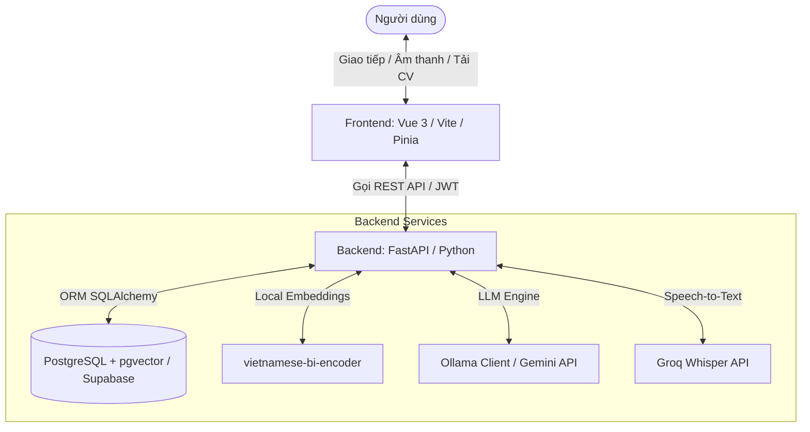

# 🚀 CV Mentor - Smart AI Resume Analyzer & Interview Coach

**CV Mentor** là một nền tảng web thông minh được phát triển để đồng hành cùng sinh viên và ứng viên trong hành trình chuẩn bị hồ sơ ứng tuyển (CV) và rèn luyện kỹ năng phỏng vấn chuyên nghiệp. Bằng cách tận dụng sức mạnh của các mô hình Trí tuệ Nhân tạo (AI), hệ thống giúp tối ưu hóa CV của bạn, đề xuất các cơ hội việc làm thích hợp và thực hiện phỏng vấn mô phỏng có đánh giá chấm điểm thời gian thực.

---

## ✨ Các Tính Năng Nổi Bật

### 🔍 1. Phân Tích CV Chuyên Sâu (CV Analysis)
- **Tải CV nhanh chóng:** Hỗ trợ tải lên CV định dạng PDF hoặc DOCX.
- **Trích xuất thông tin tự động:** AI tự động phân tích và trích xuất thông tin về kỹ năng, kinh nghiệm và học vấn.
- **Đánh giá điểm số & Bố cục:** Đánh giá điểm tổng quan của CV, đo mức độ tương thích giữa CV và Job Description (JD) cụ thể của nhà tuyển dụng.
- **Phân tích khoảng trống kỹ năng (Skill Gap Analysis):** Chỉ ra các điểm mạnh, điểm yếu và những kỹ năng còn thiếu của ứng viên.
- **Gợi ý cải thiện:** Đề xuất điều chỉnh nội dung CV và các khóa học nâng cao tương ứng.

### 🎙️ 2. Luyện Phỏng Vấn Mô Phỏng AI (Mock Interview)
- **Cá nhân hóa cao:** Thiết lập phỏng vấn theo Lĩnh vực (IT, Sales, Marketing,...), Cấp độ (Intern, Fresher, Junior) và Hình thức (HR Interview, Technical, English).
- **Hỗ trợ Đa phương thức (Multimodal):**
  - Trả lời bằng văn bản (**Text Mode**).
  - Trả lời bằng giọng nói (**Voice Mode**) tích hợp công nghệ **Speech-to-Text** (qua Groq Whisper API tốc độ cao) để nhận diện giọng nói và chuyển đổi thành văn bản.
- **Phản hồi bằng âm thanh:** AI đặt câu hỏi bằng giọng nói qua công nghệ **Text-to-Speech** (TTS).
- **Chấm điểm chi tiết:** Phân tích từng câu trả lời dựa trên 4 khía cạnh: Nội dung (Content), Cấu trúc (Structure), Khả năng giao tiếp (Communication) và Sự tự tin (Confidence).
- **Báo cáo tổng kết:** Đưa ra nhận xét tổng thể, điểm số trung bình và đề xuất câu trả lời mẫu tối ưu.

### 💼 3. Gợi Ý Việc Làm Thông Minh (Job Recommendation)
- **Tìm kiếm thông minh:** Đề xuất công việc phù hợp nhất dựa trên hồ sơ kỹ năng hiện tại trích xuất từ CV.
- **So khớp ngữ nghĩa (Semantic Search):** Sử dụng Vector Database (`pgvector` kết hợp mô hình `vietnamese-bi-encoder`) để tìm kiếm công việc một cách chính xác dựa trên ý nghĩa, thay vì chỉ so khớp từ khóa thông thường.
- **Lưu trữ công việc (Saved Jobs):** Cho phép người dùng đánh dấu lưu trữ và quản lý các công việc yêu thích để chuẩn bị ứng tuyển sau.

---

## 🛠️ Công Nghệ Sử Dụng (Tech Stack)

| Thành phần | Công nghệ chính | Vai trò / Chi tiết |
|---|---|---|
| **Frontend** | Vue.js 3, Vite, Pinia, Vue Router, Tailwind CSS | Giao diện tương tác, mượt mà, responsive, hỗ trợ đa ngôn ngữ (i18n), Web Audio API |
| **Backend** | FastAPI (Python 3.10+), Uvicorn | Hệ thống RESTful API bất đồng bộ (async) hiệu năng cao |
| **Cơ sở dữ liệu** | PostgreSQL / Supabase, pgvector | Lưu trữ dữ liệu quan hệ và Vector Embeddings cho CV/JD |
| **Mô hình Embedding** | SentenceTransformers (`vietnamese-bi-encoder`) | Biểu diễn ngữ nghĩa tiếng Việt của CV & Job Description dưới dạng Vector 768D |
| **LLM (AI Brain)** | Ollama (Local/Self-hosted), Groq API / Gemini API | Phân tích CV, sinh câu hỏi phỏng vấn, đánh giá câu trả lời và đề xuất lộ trình học tập |
| **STT & TTS** | Groq Whisper (STT), gTTS / EdgeTTS (TTS) | Nhận diện giọng nói của ứng viên và phát giọng nói của AI |

---

## 📐 Kiến Trúc Hệ Thống (System Architecture)



---

## ⚙️ Hướng Dẫn Cài Đặt và Chạy Local

### 1. Yêu cầu hệ thống
- Python 3.10 trở lên.
- Node.js (phiên bản v16 trở lên) và npm.
- Cơ sở dữ liệu PostgreSQL đã cài đặt tiện ích `pgvector`. Hoặc sử dụng dịch vụ Supabase (đã có sẵn pgvector).
- Ollama hoặc API Key (Gemini, Groq, Google API Key) tùy thuộc cấu hình trong `.env`.

### 2. Cài đặt Backend
Di chuyển vào thư mục backend và thực hiện các bước sau:
1. Tạo môi trường ảo Python:
   ```bash
   cd backend
   python -m venv venv
   venv\Scripts\activate   # Trên Windows
   # source venv/bin/activate # Trên Linux/Mac
   ```
2. Cài đặt các thư viện phụ thuộc:
   ```bash
   pip install -r requirements.txt
   ```
3. Cấu hình biến môi trường:
   Tạo file `.env` từ file mẫu trong thư mục `backend/` và cập nhật thông tin:
   ```env
   PROJECT_NAME="CV Mentor"
   VERSION="1.0.0"
   ENVIRONMENT="development"
   HOST="0.0.0.0"
   PORT=8000
   WORKERS=1
   DEBUG=True
   
   # Database connection
   DATABASE_URL="postgresql+asyncpg://<username>:<password>@<host>:<port>/<dbname>"
   
   # JWT Secret Key
   JWT_SECRET="your_super_secret_jwt_key_here"
   JWT_ALGORITHM="HS256"
   JWT_EXPIRE_HOURS=24
   
   # AI Services Config
   GOOGLE_API_KEY="your_google_api_key_here"
   OLLAMA_HOST="http://localhost:11434"
   OLLAMA_API_KEY="your_ollama_key_if_any"
   OLLAMA_MODEL="llama3" # Hoặc gpt-oss:120b
   
   # Groq Cloud API (để chạy Whisper STT miễn phí tốc độ cao)
   GROQ_API_KEY="your_groq_api_key_here"
   ```
4. Chạy migrations để khởi tạo database (nếu có):
   ```bash
   alembic upgrade head
   ```
5. Khởi động backend server:
   ```bash
   python main.py
   ```
   Backend sẽ được khởi chạy tại địa chỉ: `http://localhost:8000`. Bạn có thể truy cập `http://localhost:8000/docs` để xem tài liệu API Swagger.

### 3. Cài đặt Frontend
Di chuyển vào thư mục frontend và thực hiện:
1. Cài đặt các gói phụ thuộc Node:
   ```bash
   cd ../frontend
   npm install
   ```
2. Cấu hình biến môi trường:
   Tạo file `.env` hoặc cập nhật cấu hình API URL trỏ tới Backend (ví dụ `http://localhost:8000`).
3. Khởi động frontend ở chế độ phát triển:
   ```bash
   npm run dev
   ```
   Mở trình duyệt truy cập `http://localhost:5173` để trải nghiệm ứng dụng.

